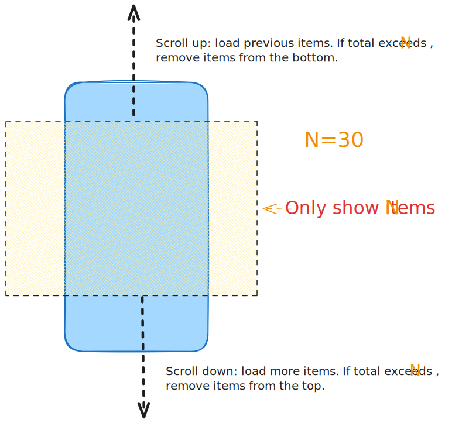

# [Broad Infinite List](https://suhaotian.github.io/broad-infinite-list/) &middot; [](https://bundlejs.com/?q=broad-infinite-list%2Freact&treeshake=%5B%7Bdefault%7D%5Dconfig=%7B%22esbuild%22%3A%7B%22external%22%3A%5B%22react%22%2C%22react-dom%22%2C%22react%2Fjsx-runtime%22%5D%7D%7D) [](https://www.npmjs.com/package/broad-infinite-list) [](https://github.com/suhaotian/broad-infinite-list/pulls) [](https://github.com/suhaotian/broad-infinite-list/blob/main/LICENSE) [](https://www.jsdocs.io/package/broad-infinite-list) 

**broad-infinite-list** is a tiny component that renders large lists efficiently by showing only a limited range of items. No need to configure each row’s height or use fixed row heights. It is suitable for chat message lists, news feed lists, and stream logs.

## Features

- 🔄 Bidirectional infinite scrolling
- ⚡ High performance - only renders fixed items
- 📏 Dynamic heights - no configuration needed
- 🪟 Window or container scrolling

## Demos

- Chat Messages List [Demo](https://suhaotian.github.io/broad-infinite-list?demo=chat)
- News feed [Demo](https://suhaotian.github.io/broad-infinite-list?demo=news)
- Logs [Demo](https://suhaotian.github.io/broad-infinite-list?demo=logs)

**How It Works**

Define a fixed window of visible items (e.g., 30 entries from a 100,000-record dataset). Load items entering the viewport as the user scrolls, and remove items leaving the viewport. This keeps rendered items constant and maintains smooth performance with large datasets.



## Installation

```bash
npm install broad-infinite-list
```

## Quick Start

> [!CAUTION]
> For vue3 or React Native usage, check the example in `vue-example/src/App.vue` or `rn-expo-example/app/(tabs)/index.tsx`

> [!NOTE]
> For React web, copy and paste the below demo code, then run it.

```tsx
"use client";
import { useState, useRef } from "react";
import BidirectionalList, {
  type BidirectionalListProps,
  type BidirectionalListRef,
} from "broad-infinite-list/react";

interface NewsItem {
  id: number;
  title: string;
  category: string;
  timestamp: number;
}

const CATEGORIES = ["Tech", "Science", "Politics", "Business"];
const TITLES = [
  "Senate Passes Landmark Infrastructure Bill",
  "New AI Model Achieves Human-Level Performance",
  "Global Temperatures Record Highest Monthly Average",
  "Startup Raises $200M Series C for Autonomous Systems",
];

const TOTAL = 1000000;
const ALL_NEWS: NewsItem[] = Array.from({ length: TOTAL }, (_, i) => ({
  id: i + 1,
  title: `${i + 1}. ${TITLES[i % TITLES.length] || ""}`,
  category: CATEGORIES[i % CATEGORIES.length] || "",
  timestamp: Date.now() - (TOTAL - i) * 3600000,
}));

const NEWS_BY_RECENCY = [...ALL_NEWS].reverse();

const VIEW_COUNT = 50;
const PAGE_SIZE = 20;

function MyList() {
  const [items, setItems] = useState<NewsItem[]>(
    NEWS_BY_RECENCY.slice(0, VIEW_COUNT)
  );

  const newestLoaded = items[0]?.id ?? 0;
  const oldestLoaded = items[items.length - 1]?.id ?? ALL_NEWS.length + 1;
  const hasPrevious = newestLoaded < ALL_NEWS.length;
  const hasNext = oldestLoaded > 1;

  const handleLoadMore: BidirectionalListProps<NewsItem>["onLoadMore"] = async (
    direction,
    refItem
  ) => {
    await new Promise((r) => setTimeout(r, 200));
    const idx = NEWS_BY_RECENCY.findIndex((n) => n.id === refItem.id);
    if (direction === "down") {
      return NEWS_BY_RECENCY.slice(idx + 1, idx + PAGE_SIZE + 1);
    } else {
      return NEWS_BY_RECENCY.slice(idx - PAGE_SIZE, idx);
    }
  };

  const listRef = useRef<BidirectionalListRef>(null);
  const showScrollTopButton = items?.[0]?.id !== NEWS_BY_RECENCY[0]?.id;
  const onScrollToFirst = () => {
    setItems(NEWS_BY_RECENCY.slice(0, VIEW_COUNT));
    listRef.current?.scrollToTop();
  };

  return (
    <>
      <BidirectionalList<NewsItem>
        ref={listRef}
        items={items}
        itemKey={(item) => item.id.toString()}
        spinnerRow={
          <div className="p-4 flex justify-center">
            <Spinner />
          </div>
        }
        renderItem={(item) => (
          <div
            style={{
              padding: 16 + item.id * 0.000035,
              borderBottom: "1px solid #ddd",
              backgroundColor: item.id % 2 === 0 ? "#eee" : "#f5f6f7",
            }}>
            <div style={{ fontWeight: 600 }}>{item.title}</div>
            <div style={{ fontSize: 12, color: "#666" }}>{item.category}</div>
          </div>
        )}
        onLoadMore={handleLoadMore}
        onItemsChange={setItems}
        hasPrevious={hasPrevious}
        hasNext={hasNext}
        viewCount={VIEW_COUNT}
        useWindow={true}
      />
      <button
        id="scrollToTopBtn"
        onClick={onScrollToFirst}
        className={
          "fixed bottom-5 right-5 bg-blue-600 text-white p-3 rounded-full shadow-lg hover:bg-blue-700 transition-opacity z-9 " +
          (showScrollTopButton
            ? "opacity-100"
            : "opacity-0 pointer-events-none")
        }>
        ↑
      </button>
      <div className="fixed z-9 top-5 p-2 text-xs right-5 rounded-xl shadow-lg bg-slate-200/55">
        <p>Total: {TOTAL}(1million)</p>
        <p>Display: {items.length}</p>
        <p>useWindow: {"true"}</p>
      </div>
    </>
  );
}

const Spinner = () => (
  <div className="size-6 border-2 border-slate-300 border-t-blue-400 rounded-full animate-spin" />
);

export default MyList;
```

### BidirectionalList Props

| Property | Type | Required | Default | Description |
|----------|------|----------|---------|-------------|
| `items` | `T[]` | Yes | - | Current array of items to display |
| `itemKey` | `(item: T) => string` | Yes | - | Function to extract a unique key from each item |
| `renderItem` | `(item: T) => React.ReactNode` | Yes | - | Function to render each item |
| `onLoadMore` | `(direction: "up" \| "down", refItem: T) => Promise<T[]>` | Yes | - | Called when more items should be loaded; returns the new items to prepend/append |
| `hasPrevious` | `boolean` | Yes | - | Whether there are more items available above the current view |
| `hasNext` | `boolean` | Yes | - | Whether there are more items available below the current view |
| `onItemsChange` | `(items: T[]) => void` | No | `undefined` | Called when the items array changes due to loading or trimming |
| `className` | `string` | No | `undefined` | The container div's className |
| `listClassName` | `string` | No | `undefined` | The list wrapper div's className |
| `spinnerRow` | `React.ReactNode` | No | `undefined` | Custom loading indicator shown during fetch |
| `emptyState` | `React.ReactNode` | No | `undefined` | Content to display when items array is empty |
| `viewCount` | `number` | No | `50` | Maximum number of items to keep in DOM; older items are trimmed |
| `threshold` | `number` | No | `10` | Pixel distance from edge to trigger loading |
| `useWindow` | `boolean` | No | `false` | If true, use window scroll instead of container scroll |
| `disable` | `boolean` | No | `false` | If true, disable loading in both directions |
| `onScrollStart` | `() => void` | No | `undefined` | Called when a programmatic scroll adjustment begins |
| `onScrollEnd` | `() => void` | No | `undefined` | Called when a programmatic scroll adjustment ends |

### BidirectionalListRef

| Property | Type | Required | Default | Description |
|----------|------|----------|---------|-------------|
| `scrollViewRef` | `RefObject<HTMLElement \| null>` | Yes | - | Reference to the scrollable container element |
| `scrollToTop` | `(behavior?: ScrollBehavior) => void` | Yes | - | Scroll to the top of the list |
| `scrollToBottom` | `(behavior?: ScrollBehavior) => void` | Yes | - | Scroll to the bottom of the list |
| `scrollTo` | `(top: number, behavior?: ScrollBehavior) => void` | Yes | - | Scroll to a specific pixel offset from top |
| `scrollToKey` | `(key: string, behavior?: ScrollBehavior) => void` | Yes | - | Scroll to an item by its key |


## Development

This project use bun, but in `rn-expo-example/` use pnpm.

```sh
bun install && bun run build
```

## Reporting Issues

Found an issue? Please feel free to [create issue](https://github.com/suhaotian/broad-infinite-list/issues/new)

## Support

If you find this project helpful, consider [buying me a coffee](https://github.com/suhaotian/broad-infinite-list/stargazers).

## Projects You May Also Be Interested In

- [xior](https://github.com/suhaotian/xior) - Tiny fetch library with plugins support and axios-like API
- [tsdk](https://github.com/tsdk-monorepo/tsdk) - Type-safe API development CLI tool for TypeScript projects
